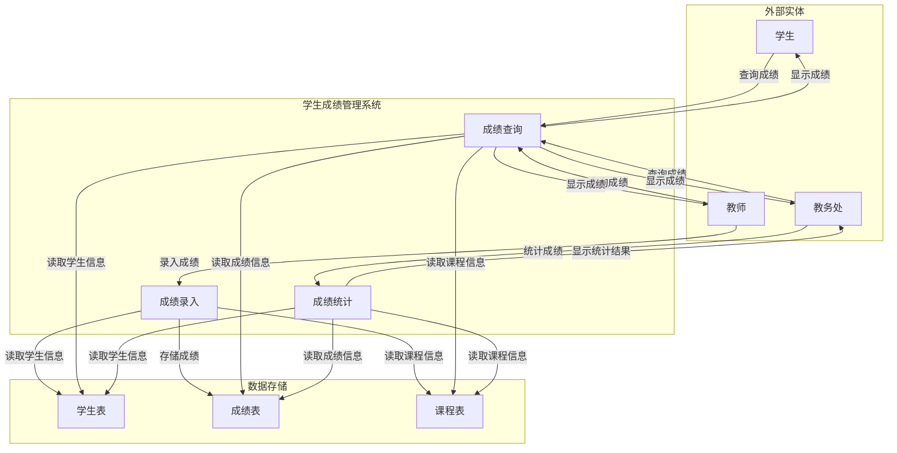

```mermaid
flowchart TD
    subgraph 外部实体
        A[学生]
        B[教师]
        C[教务处]
    end

    subgraph 学生成绩管理系统
        D[成绩录入]
        E[成绩查询]
        F[成绩统计]
    end

    subgraph 数据存储
        G[学生表]
        H[成绩表]
        I[课程表]
    end

    A -->|查询成绩| E
    B -->|录入成绩| D
    B -->|查询成绩| E
    C -->|查询成绩| E
    C -->|统计成绩| F

    D -->|存储成绩| H
    D -->|读取学生信息| G
    D -->|读取课程信息| I

    E -->|读取学生信息| G
    E -->|读取成绩信息| H
    E -->|读取课程信息| I

    F -->|读取学生信息| G
    F -->|读取成绩信息| H
    F -->|读取课程信息| I

    E -->|显示成绩| A
    E -->|显示成绩| B
    E -->|显示成绩| C
    F -->|显示统计结果| C
```