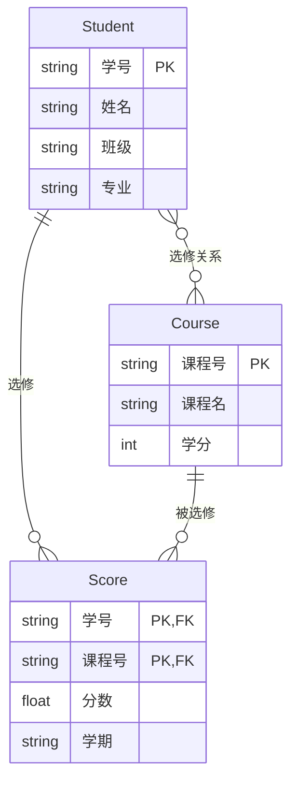

```mermaid
erDiagram
    Student ||--o{ Score : "选修"
    Course ||--o{ Score : "被选修"
    Student }o--o{ Course : "选修关系"

    Student {
        string 学号 PK
        string 姓名
        string 班级
        string 专业
    }

    Course {
        string 课程号 PK
        string 课程名
        int 学分
    }

    Score {
        string 学号 PK, FK
        string 课程号 PK, FK
        float 分数
        string 学期
    }
```