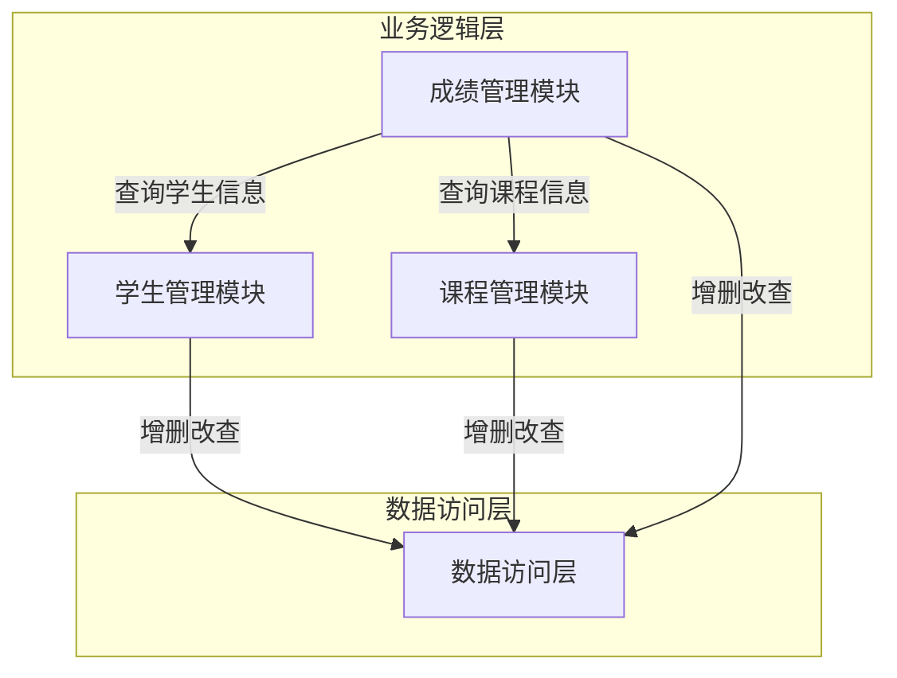

```mermaid
flowchart TD
    subgraph 业务逻辑层
        A[学生管理模块]
        B[课程管理模块]
        C[成绩管理模块]
    end

    subgraph 数据访问层
        D[数据访问层]
    end

    A -->|增删改查| D
    B -->|增删改查| D
    C -->|增删改查| D

    C -->|查询学生信息| A
    C -->|查询课程信息| B
```